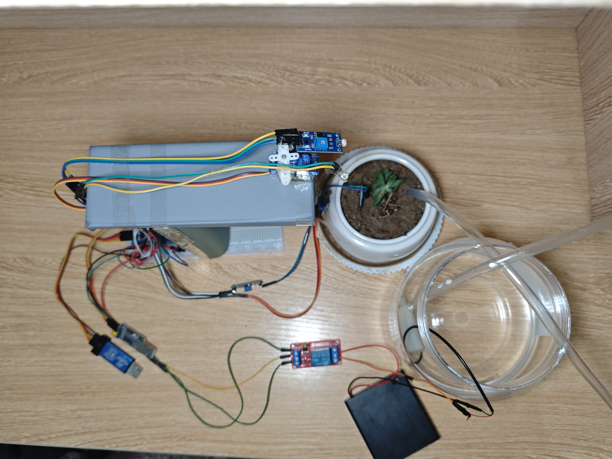

# 追光灌溉：STM32与AI驱动的智能花盆

基于 STM32 与华为云 CodeArts 的智慧农业边缘计算终端。

## 项目展示


## 功能
- 土壤湿度实时感知，自动浇水
- 光敏传感器追踪光源，舵机云台追光
- 环境光不足自动补光
- 数据上传本地后端，Web 实时监控看板

## 项目结构
- `firmware`：STM32 硬件代码（Keil 工程）
- `web`：云端代码（FastAPI + ECharts）

## 硬件接线
| 模块 | 引脚 | 连接 STM32 |
|------|------|-----------|
| 土壤湿度传感器 | VCC / GND / AO | 3.3V / GND / PA0 |
| 继电器模块 | DC+ / DC- / IN | 5V / GND / PA1 |
| SG90 舵机 | 红线 / 棕线 / 橙线 | 5V / GND / PA2 (PWM) |
| 四脚光敏传感器 | VCC / GND / AO | 3.3V / GND / PA3 |
| 三脚光敏传感器 | VCC / GND / DO | 3.3V / GND / PA5 |
| 补光灯 LED | 正极 → 1KΩ → PA6 | PA6 / GND |
| OLED 显示屏 | VCC / GND / SCL / SDA | 3.3V / GND / PB8 / PB9 |
| 串口 | TX / RX | PA9 / PA10 |

> 水泵由独立电池盒供电，继电器 COM 接电池正极，NO 接水泵正极，水泵负极接电池负极。水泵和 STM32 必须分开供电。

## 本地运行
打开命令行，进入 `yunduan` 目录：
```bash
cd web
pip install -r requirements.txt
python main.py